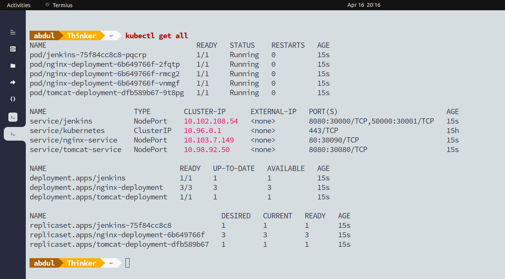
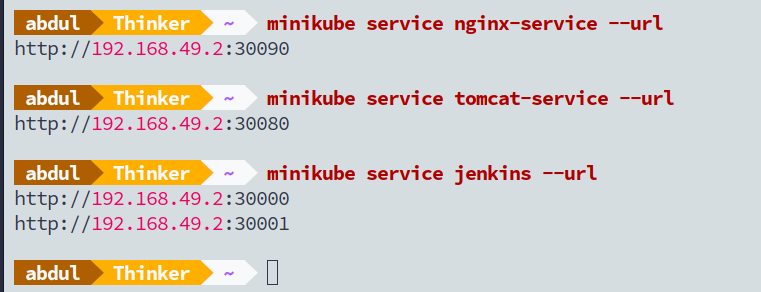
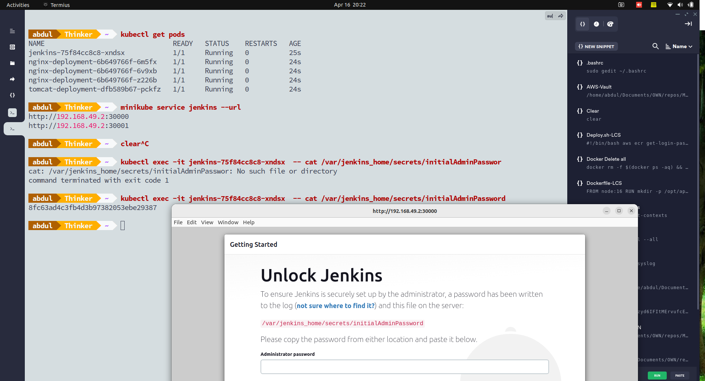

# Technical Task Details:
- Based on minikube
- Deploy 3 replicas of nginx/apache
- Include a simple "hello world" in the index.html of nginx/apache
- Deploy 1 replica of tomcat v8
- Deploy sample.war to tomcat deployment (use this:
https://tomcat.apache.org/tomcat-8.0-doc/appdev/sample/)
- Deploy a jenkins pod (1 replica)
- Configure a static "dummy" job in jenkins
- Submit the project as a set of yaml manifests, Dockerfiles, bash scripts, xml files, and anything else
you deem appropriate.
- Include a simple/short README file that tells how to operate the project.
- Archive everything into a zip or tar.gz, and upload it to the link provided, send it via email or provide
a direct link.


# Solution Information

- Each file contains;
    - nginx.yaml: nginx with 3 replica
    - tomcat.yaml: tomcat with 1 replica
    - jenkins.yaml: jenkins with persistent volume
- I have used same docker images for nginx and tomcat, that used in Task-1
-  To run, change the path to manifests and run
```
kubectl create -f .
```
- Get all deployment information
```
kubectl get all
```

- Output can be accessible from each services

- Jenkins initial password can retrived as shown below

- Also jenkins is persistent/static, which even if pod get deleted old jenkins jobs will still remain in volume
