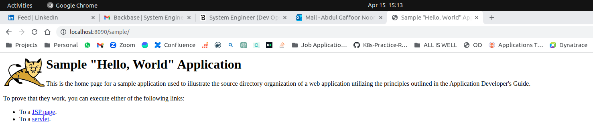
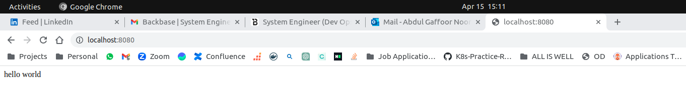
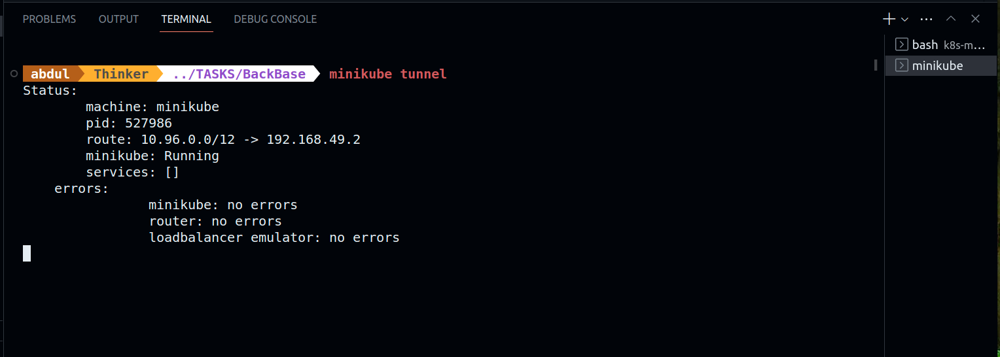
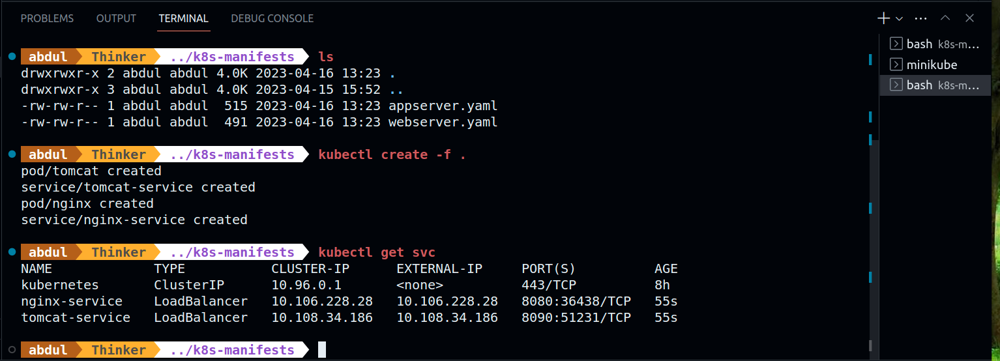
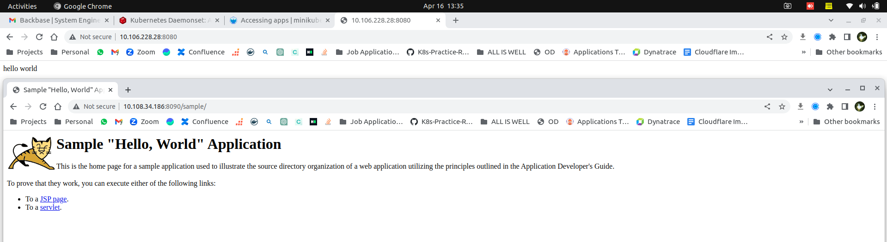

# Task-1
Task Details:
- Based on Minikube
- Deploy tomcat v8 to minikube
- Deploy sample.war to tomcat (use this: https://tomcat.apache.org/tomcat-8.0-doc/appdev/sample/ )
- Bind tomcat service to hostport 8090
- Deploy nginx/apache to minikube
- Bind nginx/apache to hostport 8080
- Include simple "hello world" in index.html of nginx


# Solution Information

## Containerization Using Docker
### Tomcat
- Dockerfile.tomcat, that takes sample.war file, which is the example app has been packaged as a war file
- Image Building
```
docker build -t my-tomcat -f deploy/Dockerfile.tomcat .
```
- Running tomcat on port: 8090
```
docker run -itd -p 8090:8080 my-tomcat
```

- Docker Tag and Push
```
docker tag my-tomcat gaffoor/my-tomcat:v1

docker push gaffoor/my-tomcat:v1
```

### NGINX
- Dockerfile.nginx, that takes index.html which prints "hello world"
- Image Building
```
docker build -t my-nginx -f Dockerfile.nginx .
```
- Running NGINX on Port: 8080
```
docker run -itd -p 8080:80 my-nginx
```

- Docker Tag and Push
```
docker tag my-nginx gaffoor/my-nginx:v1

docker push gaffoor/my-nginx:v1
```

## Orchestration using Kubernetes

- K8s cluster is Minikube in this.
- To make Port binding happen, we can LoadBalancer as service. To use Loadbalancer, we can use mikikube tunnel.
- Use minikube tunnel and keep it running in background 


- In Manifests path, run the files
```
kubectl create -f .
```
- We can access tomcat output at 8090 and nginx at 8080

